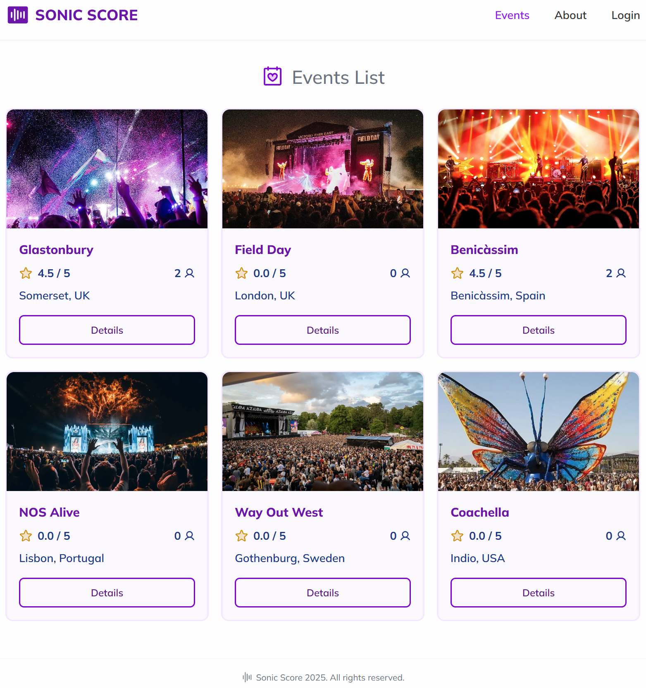

# Sonic Score

An Ironhack Web-Dev Bootcamp project

### Description

Sonic Score is a web platform for music lovers to discover and rate music festivals based on real experiences.
Users can review festivals by category — from atmosphere and music quality to safety and organization — helping others make smarter choices.
Join the community, share your voice, and explore the world’s top music festivals through authentic feedback.

### Project Tech Stack

- JavaScript
- React
- Tailwind CSS
- Vite
- Firebase real-time database
- Firebase authentication
- Toastify
- Phosporicons
- git

### Deployment link

https://sonic-score.netlify.app/

### Development

The project was developed in pair-programming by

- Pedram Ghane, https://github.com/iampedi
- André Kaltenbach, https://github.com/andrekaltenbach
